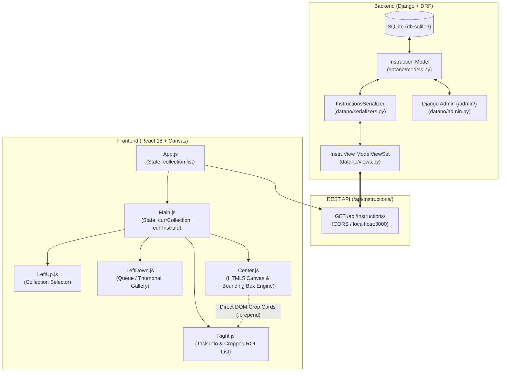

# DATANO Architecture & Functionality Analysis

**Author:** Senior Software Engineer  
**Date:** March 2026 (Analyzed Codebase: April 2023)  
**Repository:** [DATANO](file:///Users/mohamed/DATANO)  
**Primary Scope:** Full-stack deep dive into Django REST backend & React Canvas annotation frontend

---

## 1. Executive Summary

**DATANO** is a specialized web-based computer vision annotation and image labeling platform designed to allow human annotators to inspect datasets, view annotation instructions, draw bounding boxes / region-of-interest (ROI) crops on target images, and inspect task metadata.

The platform is architected as a decoupled client-server application:
* **Backend:** Built with **Python 3**, **Django 4.1.7**, and **Django REST Framework (DRF)**, backed by **SQLite**. It serves as an instruction and task delivery API.
* **Frontend:** Built with **React 18** and native **HTML5 Canvas 2D API** (with Bootstrap and Tailwind CSS styling), providing an interactive three-column workspace for dataset selection, canvas drawing/cropping, and annotation inspection.

---

## 2. High-Level Architecture & Data Flow



### Data Lifecycle:
1. **Task Fetching:** Upon mounting, [App.js](file:///Users/mohamed/DATANO/frontend/src/App.js) executes `axios.get("/api/Instructions/")` to fetch all task definitions from the Django backend.
2. **Collection Partitioning:** [Main.js](file:///Users/mohamed/DATANO/frontend/src/components/Main.js) partitions the flat task list into unique collections (e.g., `Commerce`, `Faces`, `Trafic`).
3. **Queue Selection:** The user picks a collection in [LeftUp.js](file:///Users/mohamed/DATANO/frontend/src/components/LeftUp.js), filtering the "Up Next" queue rendered in [LeftDown.js](file:///Users/mohamed/DATANO/frontend/src/components/LeftDown.js).
4. **Canvas Loading:** Selecting an image thumbnail updates `currInstruId`, passing the task object to [Center.js](file:///Users/mohamed/DATANO/frontend/src/components/Center.js).
5. **Interactive Drawing:** [Center.js](file:///Users/mohamed/DATANO/frontend/src/components/Center.js) dynamically renders the image on an HTML5 canvas and listens for mouse interactions (`mousedown`, `mousemove`, `mouseup`) to draw bounding boxes.
6. **ROI Extraction:** On `mouseup`, the selected region is cropped using canvas `drawImage()`, converted to a DataURL via `canvas.toDataURL()`, and dynamically prepended as a thumbnail card with a delete button to the annotations container in [Right.js](file:///Users/mohamed/DATANO/frontend/src/components/Right.js).

---

## 3. Backend Deep Dive (Django & DRF)

### 3.1 Data Model: `Instruction`
Location: [backend/datano/models.py](file:///Users/mohamed/DATANO/backend/datano/models.py)  
Database Table: `datano_instruction`

The schema encapsulates task configuration, image location, and annotation instructions:

| Field Name | Type | Default | Description |
| :--- | :--- | :--- | :--- |
| `id` | `BigAutoField` (Auto) | Auto | Primary key |
| `taskId` | `TextField` | - | External alphanumeric task/image identifier (e.g., `NqVwY69041VP`) |
| `collection` | `TextField` | `'1'` | Dataset category partition (e.g., `Commerce`, `Faces`, `Trafic`) |
| `createdAt` | `TextField` | `' '` | Task creation timestamp string |
| `completedAt` | `TextField` | `' '` | Completion timestamp string |
| `status` | `TextField` | `' '` | Workflow status flag (e.g., pending, completed) |
| `instru` | `TextField` | `' '` | Labeling instruction prompt displayed to annotator |
| `typeInstru` | `TextField` | `'Instru'` | Instruction type category |
| `urgency` | `TextField` | `'now'` | Priority level (e.g., `High`, `now`) |
| `api_key` | `TextField` | `' '` | Client API key or tenant authentication token |
| `src` | `TextField` | `''` | Static asset path to target image (e.g., `./images/Trafic4.jpg`) |

#### Existing Seed Datasets in SQLite:
* **Trafic:** 19 tasks (Instructions: e.g., *"Crop only 4 tires vehicules"*)
* **Commerce:** 12 tasks (Instructions: product labeling)
* **Faces:** 11 tasks (Instructions: face region detection)

### 3.2 Serialization & API Layer
* **Serializer ([backend/datano/serializers.py](file:///Users/mohamed/DATANO/backend/datano/serializers.py)):**
  ```python
  class InstructionsSerializer(serializers.ModelSerializer):
      class Meta:
          model = Instruction
          fields = ('id', 'taskId', 'collection', 'createdAt', 'status', 'instru', 'typeInstru', 'urgency', 'api_key', 'src')
  ```
  *(Note: `completedAt` is in the database model but omitted from the serialized fields).*

* **Viewset ([backend/datano/views.py](file:///Users/mohamed/DATANO/backend/datano/views.py)):**
  Inherits from `rest_framework.viewsets.ModelViewSet`. Full CRUD support out of the box:
  * `GET /api/Instructions/` — List all instruction items
  * `POST /api/Instructions/` — Create new instruction
  * `GET /api/Instructions/<id>/` — Retrieve specific instruction
  * `PUT /api/Instructions/<id>/` — Full update of instruction
  * `PATCH /api/Instructions/<id>/` — Partial update
  * `DELETE /api/Instructions/<id>/` — Remove instruction

* **Routing ([backend/backend/urls.py](file:///Users/mohamed/DATANO/backend/backend/urls.py)):**
  Uses DRF's `DefaultRouter()` registered with prefix `Instructions`.

* **Admin Portal ([backend/datano/admin.py](file:///Users/mohamed/DATANO/backend/datano/admin.py)):**
  `admin.ModelAdmin` registered with list display: `('collection', 'createdAt', 'status', 'instru', 'typeInstru', 'urgency', 'src')`.

---

## 4. Frontend Deep Dive (React & HTML5 Canvas)

### 4.1 Component Responsibility Matrix

| Component | Path | State & Primary Responsibilities |
| :--- | :--- | :--- |
| **`App`** | [App.js](file:///Users/mohamed/DATANO/frontend/src/App.js) | Top-level container. Loads API data via Axios on `componentDidMount`. Renders top navigation bar and delegates dataset to `Main`. |
| **`Main`** | [Main.js](file:///Users/mohamed/DATANO/frontend/src/components/Main.js) | Layout coordinator (3 columns). Manages selection state: `currCollectionName`, `currInstruId`, `isCcollectionSelected`. Filters datasets and task items. |
| **`LeftUp`** | [LeftUp.js](file:///Users/mohamed/DATANO/frontend/src/components/LeftUp.js) | Category/Collection selector. Renders checkboxes dynamically based on unique collection values present in backend data. |
| **`LeftDown`** | [LeftDown.js](file:///Users/mohamed/DATANO/frontend/src/components/LeftDown.js) | "Up Next" scrollable image feed. Displays all image thumbnails for the active collection. Triggers task loading on image click. |
| **`Center`** | [Center.js](file:///Users/mohamed/DATANO/frontend/src/components/Center.js) | Core workspace: Displays current instruction header, dynamic HTML5 Canvas `#imgCanva`, interactive ROI bounding box drawing engine, and feedback comment box. |
| **`Right`** | [Right.js](file:///Users/mohamed/DATANO/frontend/src/components/Right.js) | Metadata inspector: Displays `Instruction`, `taskId`, `createdAt`, `urgency`. Hosts the `#cropat` container where extracted annotation thumbnails are mounted. |
| **`Crop`** *(Aux)* | [Crop.js](file:///Users/mohamed/DATANO/frontend/src/components/Crop.js) | Standalone proof-of-concept using React Hooks (`useRef`, `useState`) and `<input type="file">` for local file cropping via `getImageData`/`putImageData`. |

### 4.2 Interactive Canvas & Bounding Box Engine Mechanics

The canvas engine in [Center.js](file:///Users/mohamed/DATANO/frontend/src/components/Center.js) implements custom bounding box drawing and ROI extraction using native canvas APIs:

1. **Responsive Canvas Initialization:**
   ```javascript
   img.onload = function() {
       ctx1.canvas.width = img.width;
       ctx1.canvas.height = img.height;
       cntrl.style.height = (((7/12)*(window.innerWidth))*(img.height)/(img.width)).toString() + "px";
       ctx1.drawImage(img, 0, 0);
   }
   ```
   The canvas dynamically calculates height to preserve the original image aspect ratio inside the 7-column Bootstrap layout ($7/12 \times \text{window.innerWidth}$).

2. **Coordinate Normalization (`qsstiKanvaDown` & `qsstiKanvaMove`):**
   When the mouse is pressed and dragged, client coordinates are mapped into the scaled canvas plane:
   $$\text{Coord}_X = |\text{pageX} - (\text{innerWidth} \times \frac{2}{12})| \times \frac{300}{\text{innerWidth} \times \frac{7}{12}}$$
   $$\text{Coord}_Y = (\text{pageY} - 148) \times \frac{150}{\text{imgHeight}}$$
   A semi-transparent red rectangle (`fillStyle = "#FF0000"`, `globalAlpha = 0.4`) is rendered on an overlay canvas layer to give live visual feedback.

3. **Sub-Image Crop Extraction (`qsstiKanvaUp`):**
   On mouse release:
   * The sub-bounding region is extracted from `mainImage` onto an offscreen canvas using `ctx.drawImage()`.
   * Converted to an image URL via `canvas.toDataURL()`.
   * Encapsulated into a DOM card along with a delete button (`x`).
   * Injected directly into the DOM tree (`document.querySelector('#cropat').prepend(elem)`).
   * Coordinates `[X, Y, width, height]` are recorded in memory in `theCropsCord`.

4. **Crop Deletion (`delCrop`):**
   Clicking the `x` button on any crop card query-selects matching `#crp<id>` elements and removes them from the DOM, decrementing `nbCrop`.

---

## 5. Functionality Summary & Implementation Status

| Feature / Capability | Subsystem | Implementation Status | Technical Details |
| :--- | :--- | :--- | :--- |
| **Dataset Collections** | Backend & Frontend |  **Implemented** | Backend stores `collection` field. Frontend dynamically extracts unique collections and provides single-select checkbox filtering. |
| **Task Queue ("Up Next")** | Frontend |  **Implemented** | Scrollable vertical thumbnail list filtering tasks by active collection. |
| **Instruction Display** | Backend & Frontend |  **Implemented** | Natural language instructions rendered prominently above the canvas and in the right inspector. |
| **Task Metadata Inspection** | Backend & Frontend |  **Implemented** | Displays Task ID, Creation Timestamp, Urgency level, and instruction details. |
| **Interactive Canvas Rendering** | Frontend |  **Implemented** | Native HTML5 Canvas 2D image rendering with aspect-ratio preservation. |
| **Bounding Box Drawing** | Frontend |  **Implemented** | Live mouse-drag rectangle drawing with semi-transparent overlay fill. |
| **ROI Sub-Image Cropping** | Frontend |  **Implemented** | Automatic extraction of cropped image preview cards using `toDataURL()`. |
| **Crop Removal** | Frontend |  **Implemented** | Individual deletion of cropped items via delete button (`delCrop`). |
| **User Comments / Notes** | Frontend | ⚠️ **Partial (UI Only)** | Textarea `#brr` present in UI; comments are not wired to state or backend. |
| **Annotation Persistence** | Full-Stack | ❌ **Missing** | No database model, serializer, or API endpoint exists to save crop coordinates, labels, or completions back to the server. |
| **User Authentication / RBAC** | Full-Stack | ⚠️ **Partial** | Django `auth_user` exists in DB, `api_key` field exists on model, but no token/session auth is implemented on frontend or DRF endpoints. |
| **Polygon / Keypoint / Segmentation** | Frontend | ❌ **Not Implemented** | Only rectangular bounding box / crop is supported. |
| **Dataset Export (COCO, YOLO, VOC)** | Backend | ❌ **Not Implemented** | No export serializing bounding boxes to standard ML formats. |

---

## 6. Senior Engineering Assessment: Technical Debt & Architectural Gaps

1. **Direct DOM Manipulation in React:**
   * In [Center.js](file:///Users/mohamed/DATANO/frontend/src/components/Center.js), child canvases and annotation cards are created using `document.createElement()` and inserted using `appendChild` / `prepend` directly targeting `#cropat` in [Right.js](file:///Users/mohamed/DATANO/frontend/src/components/Right.js).
   * *Impact:* Violates React's declarative state model; annotations are not stored in React state, causing them to desynchronize or vanish upon re-render or task switching.
2. **Hardcoded Coordinate Math & Breakpoint Brittleness:**
   * Coordinate math in [Center.js](file:///Users/mohamed/DATANO/frontend/src/components/Center.js) relies on hardcoded pixel offsets (`148px`, `300`, `150`).
   * *Impact:* Bounding boxes misalign if the user resizes the window, scrolls, or views the application on different display scales.
3. **Missing Annotation Model & Persistence Pipeline:**
   * The backend `Instruction` model only stores input tasks. There is no `Annotation` model (e.g., `task_id`, `x`, `y`, `width`, `height`, `label`, `annotator`).
4. **Typo in Django Model `__str__`:**
   * In [backend/datano/models.py](file:///Users/mohamed/DATANO/backend/datano/models.py): `def _str_(self): return self.istru` has single underscores and references non-existent `self.istru`, which will raise an `AttributeError` when printed.
5. **Security & Production Hardening:**
   * Django [settings.py](file:///Users/mohamed/DATANO/backend/backend/settings.py) has `DEBUG = True`, empty `ALLOWED_HOSTS`, hardcoded secret key, and DRF viewsets have no permission classes (`AllowAny` by default).
6. **Unused Dependencies:**
   * Packages `fabric`, `jquery`, and `canvas` in `package.json` are installed but unused, inflating bundle size.
7. **Informal Naming Conventions:**
   * Variables and element IDs use Darija/informal colloquialisms (`qsstiKanvaDown`, `tkhrbiqa`, `santr`, `foqcentral`, `cropat`, `lezobjet`), suitable for early hacking but requiring refactoring for production maintainability.

---

## 7. Modernization & Production Roadmap

### Phase 1: Persistence & Schema Normalization
1. Fix typo in [models.py](file:///Users/mohamed/DATANO/backend/datano/models.py) (`__str__` -> `return self.instru`).
2. Create an `Annotation` model in Django:
   ```python
   class Annotation(models.Model):
       instruction = models.ForeignKey(Instruction, related_name='annotations', on_delete=models.CASCADE)
       x = models.FloatField()
       y = models.FloatField()
       width = models.FloatField()
       height = models.FloatField()
       label = models.CharField(max_length=100, blank=True)
       comment = models.TextField(blank=True)
       created_at = models.DateTimeField(auto_now_add=True)
   ```
3. Expose `/api/Annotations/` endpoints with batch submission capabilities.

### Phase 2: React State Refactoring
1. Eliminate direct DOM manipulation (`document.createElement`, `prepend`).
2. Lift annotations into React state:
   ```javascript
   const [annotations, setAnnotations] = useState([]);
   ```
3. Render annotation cards declaratively in `Right.js` mapped from state.
4. Replace hardcoded coordinate calculation with dynamic bounding rect calculations:
   ```javascript
   const rect = canvasRef.current.getBoundingClientRect();
   const x = (event.clientX - rect.left) * (canvas.width / rect.width);
   const y = (event.clientY - rect.top) * (canvas.height / rect.height);
   ```

### Phase 3: Export & ML Pipeline Integration
1. Implement export endpoints for standard ML formats (**COCO JSON**, **YOLO txt**, **Pascal VOC XML**).
2. Add pagination and filtering (`/api/Instructions/?collection=Trafic&status=pending`).
3. Clean up `package.json` to remove unused packages (`fabric`, `jquery`, `canvas`).
